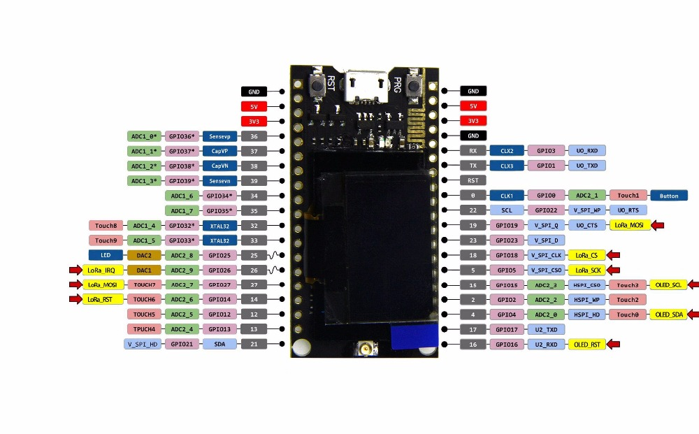
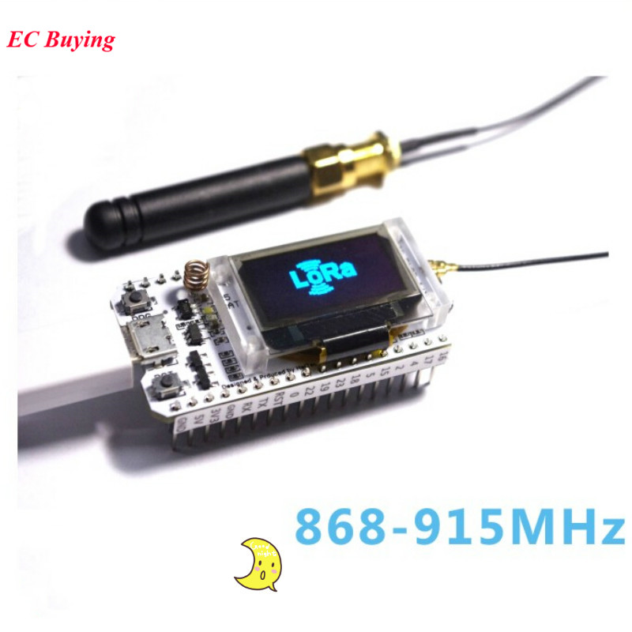
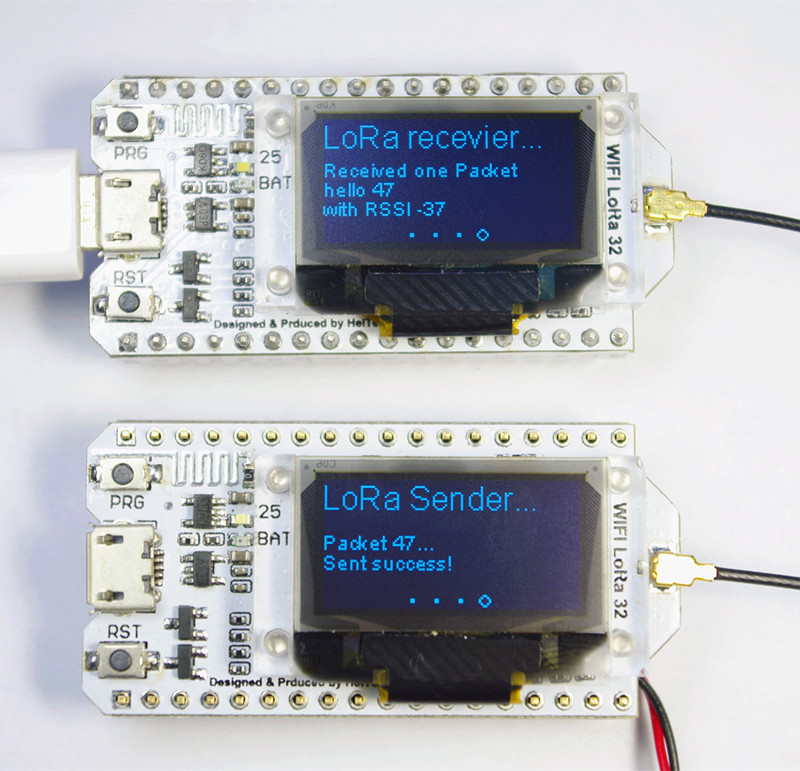
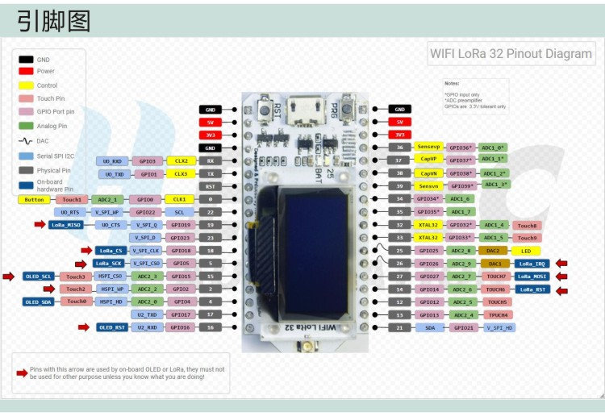

# Micropython & Lora

[Micropython & Lora](https://lemariva.com/blog/2018/10/micropython-esp32-sending-data-using-lora)

[Driver micropython para Lora](https://github.com/rcludwick/Lora_driver_for_MicroPython_on_ttgo)

## TTGO LORA SX1278

[TTGO LORA SX1278 ESP32 0.96 OLED 16 Mb 433Mhz](https://www.aliexpress.com/snapshot/0.html?spm=a2g0s.9042647.6.2.9b9263c0LTnB3b&orderId=505094153390875&productId=32832523252)

(if the antenna is not connected, it may damage the LoRa chip)

This product is a SX1278 chip based on ESP32 WIFI increased OLED, namely LoRa remote modem, 433MHz frequency, high sensitivity is about -148dBm, +20dBm output power, high reliability, long transmission distance.
The onboard 32MByte Flash, Wi-Fi antenna, 0.96 inch blue OLED display, lithium battery charging circuit, CP2102 interface and USB serial chip, the perfect support for Arduino development environment, can be used for program verification and product development is very simple and fast.
Operating voltage: 3.3V to 7V
Operating temperature range: -40 degrees C to +90 degrees C
Support for Sniffer, Station, softAP, and Wi-Fi Direct modes
Data rates: 150 Mbps@11n HT40, 72 Mbps@11n HT20, 54 Mbps@11g, 11 Mbps@11b
Transmit power: 19.5 dBm@11b, 16.5 dBm@11g, 15.5 dBm@11n
Receiver sensitivity up to -98 dBm
UDP sustained throughput of 135 Mbps

[Codigo arduino](https://eyun.baidu.com/s/3hsiTNgg#sharelink/path=%2F%E6%96%B0%E5%BB%BA%E6%96%87%E4%BB%B6%E5%A4%B9&parent_path=%2F%E6%B7%B1%E5%9C%B3%E5%B8%82%E8%8A%AF%E5%85%83%E7%94%B5%E5%AD%90%E7%A7%91%E6%8A%80%E6%9C%89%E9%99%90%E5%85%AC%E5%8F%B8)

### Pinout

## 

[868MHz 915MHz SX1276 ESP32 LoRa OLED 0.96](https://www.aliexpress.com/snapshot/0.html?spm=a2g0s.9042647.6.2.150763c0RJKko3&orderId=505026897360875&productId=32838347451)

Dominant Frequency: 240MHZ
Flash: 32M-Bits
Processor: for Tensilica LX6 Dual Core
Master chip: ESP32
LoRa chip: SX1276
Support frequency band: 868-915MHZ
Open communication distance: 2.8KM
Computing capacity: up to 600DMIPS
Dual-mode Bluetooth: traditional Bluetooth and BLE low-power Bluetooth
Development environment: perfect support for Arduino
Operating voltage: 3.3-7V
Operating temperature range: -40-90 ℃
Receiver sensitivity: -139dBm (SF12, 125KHZ)
UDP continuous throughput: 135Mbps
USB adapter chip: CP2102
Support mode: Sniffer, Station, softAP and Wi-Fi Direct
Transmit power: 19.5dBm@11b, 16.5dBm@11g, 15.5dBm@11n
Data rate: 150Mbps @ 11n HT40, 72Mbps @ 11n HT20,
54Mbps @ 11g, 11Mbps @ 11b
 
 
 Please check this link and you could download the instruction from it.
https://github.com/Heltec-Aaron-Lee/WiFi_Kit_series
Otherwise, please connect the antenna with the connector IPEX 868-915MHz antenna. or the LoRa chip will be burned.

## Proyectos

[Lora + MQTT + mcs4514](https://github.com/tnugent97/FutAir)