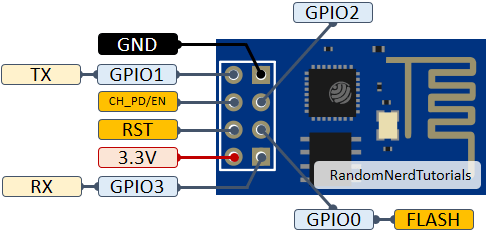
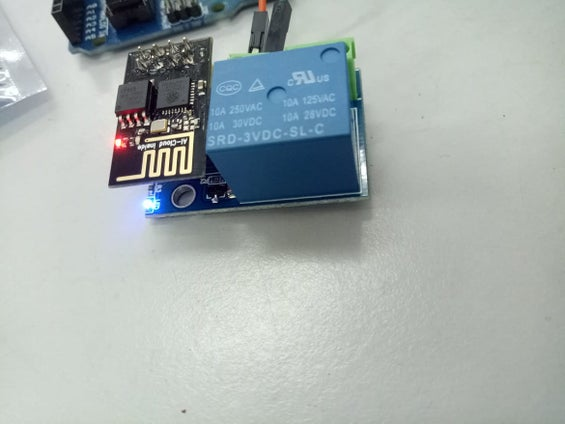
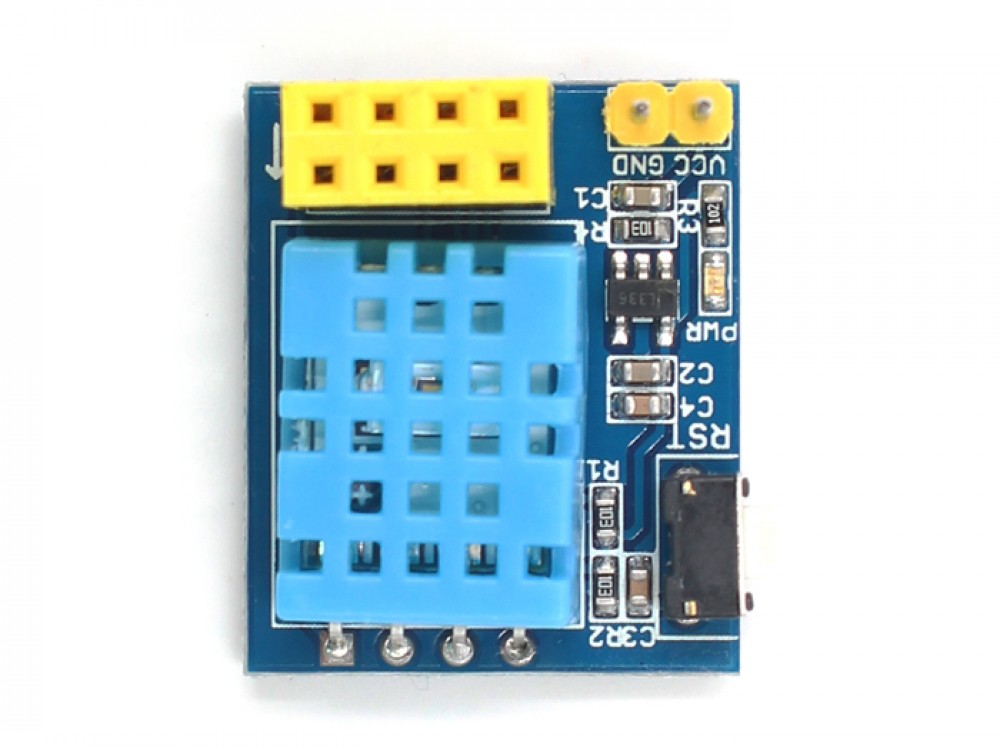

# Tutorial ESP8266 esp01 con micropython

GPIO0
GPIO2
TX
RX

## Shields

### Sensor de temperatura ds18b20 (GPIO2)

[Esquemático](https://github.com/IOT-MCU/ESP-01-01S-DS18B20-v1.0/blob/master/ESP-01S%20DS18B20%20v1.0%20sch.pdf)

### Relé (GPIO0)

[Esquemático](https://github.com/IOT-MCU/ESP-01S-Relay-v4.0/blob/master/ESP-01S%20Relay%20v4.0.pdf)

### Sensor de temperatura y humedad DHT11 (GPIO2)
¿Hay que modificar el umbral para que lea bien? En código Arduino 11 está bien para ESP8266
[Esquemático](https://github.com/IOT-MCU/ESP-01S-DHT11-v1.0)

### Led RGB neopixel (GPIO2)

[Esquemático](https://github.com/IOT-MCU/ESP-01S-RGB-LED-v1.0/blob/master/ESP-01S%20RGB%20LED%20v1.0.zip)

## Módulos

[Módulo con rele](https://www.instructables.com/ESP0101S-RELAY-MODULE-TUTORIAL/)

Relé en GPIO00

[Módulo con DHT11](https://www.makerfabs.com/esp-01-dht11-module.html)

DHT11 en GPIO02

## Referencia

[workshop micropython en esp8266](https://micropython-on-esp8266-workshop.readthedocs.io/en/latest/basics.html)

[Tutorial  de micropython para ESP8266](https://docs.micropython.org/en/latest/esp8266/tutorial/index.html#esp8266-tutorial)
