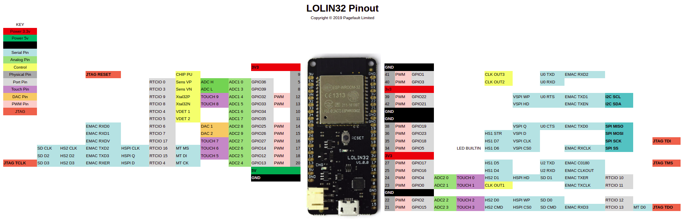

# Tutorial de micropython con ESP32


## Flashear micropython

```
esptool.py --port /dev/ttyUSB0 erase_flash
```

[Descargamos el firmware](http://micropython.org/download#esp32)

```
esptool.py --chip esp32 --port /dev/ttyUSB0 write_flash -z 0x1000 esp32-20180511-v1.9.4.bin
```

Conectamos al REPL

```
screen /dev/ttyUSB0 115200
```

## Builtin led

>>> import machine
>>> led = machine.Pin(5,machine.Pin.OUT))
>>> led.on() # Esta invertido
>>> led.off()

## configuramos wifi


## Modelos

### Lolin32




[Esquematico de Lolin32 ESP32](https://wiki.wemos.cc/_media/products:lolin32:sch_lolin32_v1.0.0.pdf)

## Referencia

[Quick Reference](https://docs.micropython.org/en/latest/esp32/quickref.html)
