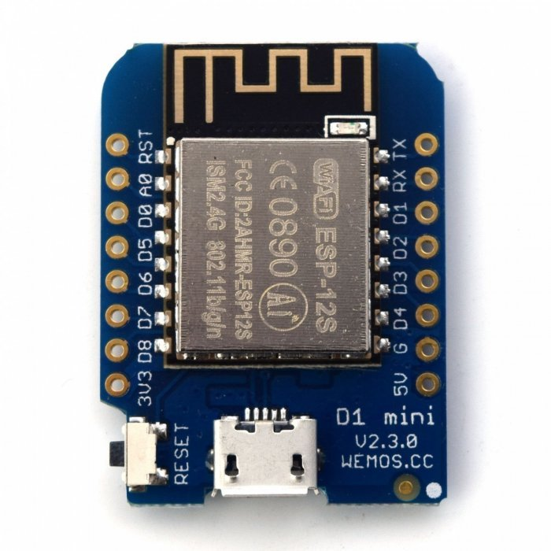
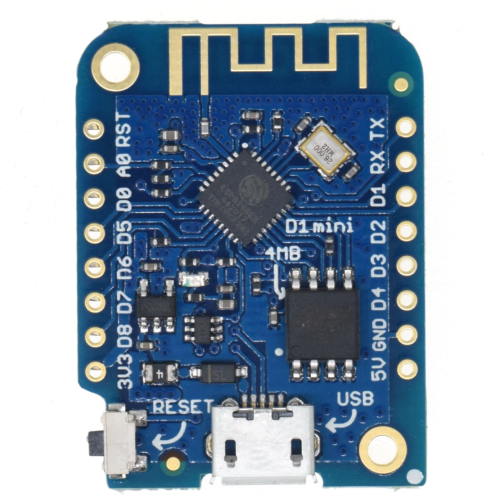

# Tutorial de micropython basado en Wemos

TODO: Descripción de Wemos ¿Memoria? ¿coste?



Basado en ESP12

TODO: ¿qué es micropython?

## Flasheando micropython

En primer lugar vamos a flasher nuestro Wemos D1 Mini con el firmware de micropython 
TODO: URL descarga

Conectamos con un cable micro-USB

```
esptool.py --port /dev/ttyUSB0 erase_flash
```


```
esptool.py --port /dev/ttyUSB0 --baud 460800 write_flash --flash_size=detect-fm dio 0 ~/Descargas/esp8266-20191121-v1.11-586-g1530fda9c.bin 
```

Si usamos una **Wemos D1 mini**, que usa un ESP8265 cambiamos el parámetro dio por dout, quedando así



```
esptool.py --port /dev/ttyUSB0 --baud 460800 write_flash --flash_size=detect -fs 1MB -fm dout  0 ~/Descargas/esp8266-20191121-v1.11-586-g1530fda9c.bin
```

## Accediendo a la consola python

Accedemos a la consola REPL con un programa terminal como por ejemplo **screen** 

```
screen /dev/ttyUSB0 115200
```

Pulsamos varias veces **Enter** y veremos que aparece en prompt de python

```
>>>
```

## Accediendo por Wifi a la consola: WebREPL

Para poder acceder remotamente vía wifi activamos y configuramos **WebREPL** escribiendo en modo interactivo

```python
>>> import weprepl_setup
```

Contestamos a lo que nos pregunta, establecemos una contraseña de acceso y finalmente se resetea


## Configuración de red

Configuramos la red (esta configuración se mantendrá tras un reset)

```python
>>> wl = network.WLAN(network.STA_IF)
>>> wl.active(True)
>>> wl.scan()
>>> wl.connect("SSID","CLAVE_SSID")
>>> wl.ifconfig() # ('192.168.1.55', '255.255.255.0', '192.168.1.1', '192.168.1.1') 

```

## Acceso a fecha y hora

```python

>>> rtc = machine.RTC()
>>> rtc.datetime() # (2000, 1, 1, 5, 1, 50, 24, 554) 
```


Ya que tenemos acceso a internet vía Wifi, vamos a usar el protocolo ntp para actualizar la hora


```python

>>> import ntptime
>>> ntptime.settime()
>>> rtc.datetime()  # (2019, 12, 7, 5, 19, 20, 41, 160)
```

[Ejemplo para tener en cuenta timezone](https://forum.micropython.org/viewtopic.php?t=5145)

### Usando fechas

>>> import utime
>>> utime.time() # Epocs time: Segundos desde 1,1,1970 (GMT)
>>> utime.localtime(utime.time()) # tupla con formato (year,month,day,hour,minute,seconds,day of week, day of year)
>>> utime.localtime(utime.time()+3600) # Sumamos la hora para tiempo localtime

## Formatos de impresion

https://www.geeksforgeeks.org/python-output-formatting/

"{0}/{1:02}/{2:02} {3:02}:{4:02}:{5:02}".format(*utime.localtime(utime.time()+3600)[0:6])


## Acceso a los pines

Para facilitar el uso de los pines usaremos el módulo [Wemos.py](https://github.com/javacasm/micropythonTutorial/blob/master/codigo/Wemos.py) que nos permite usar los nombre de los pines que usa Wemos en lugar de los GPIO del ESP12 que utiliza micropython


TODO: explicación de ficheros main.py y boot.py
TODO: Donde se guarda el prompt
TODO: C´omo subir un fichero

### Usando el Led builtIn

Vamos a empezar encendiendo apagando el led de la placa ESP12 conectado a D4

```python
import machine
import wemos

led = machine.Pin(Wemos.D4, machine.Pin.OUT) # LED Builtin

led.off() # Esta invertido
led.on()

```

También se puede hacer **led.value(1)** ó **led.value(0)** o usar **led.value()** para conocer el valor

## Relé


```python
import machine
import wemos

rele = machine.Pin(Wemos.D1,machine.Pin.OUT)

rele.on() # Encendemos el rele

rele.off() # Apagamos el rele
```

# PWM: regulando el nivel de un salida

Vamos a usar el pin

```python
import machine
import time
import Wemos

pwm = machine.mPWM(machine.Pin(Wemos.D4))

# Recordamos que el D4 esta invertido
pwm.duty(0) # encendido a tope de brillo
time.sleep(1)
pwm.duty(512) # brillo al 50%
time.sleep(1)
pwm.duty(1022) # minimo valor iluminado
time.sleep(1)
pwm.duty(1023) # apagado

```

Podemos modificar la frecuencia de PWM usando pwm.freq(frecuencia), pudiendo estar entre 1Hz y 1kHz

Como ejemplo curioso si usamos la frecuencia de 1Hz (o valores por debajo de los 25 Hz) veremos parpadear el led

```python
pwm.freq(24)
pwm.duty(512) # 50%
```

### Servos

Una aplicación del PWM es el control de los conocidos servos (o servomotores)

```python

import machine

servo = machine.PWM(machine.Pin(25),freq = 50)
servo.duty(45) # Posicion minima
servo.duty(77) # Posicion central
servo.duty(115) # Posicion maxima

```

### TODO: analógicos en A0

```python
adc = ADC(0)            # create ADC object on ADC pin
adc.read()              # read value, 0-1024
```		


## Neopixel

```python
import neopixel,machine
import Wemos

ledRGB = neopixel.NeoPixel(machine.Pin(Wemos.D2),1) 

# Rojo
ledRGB[0] = (50,0,0)
ledRGB.write()
# Verde
ledRGB[0] = (0,50,0)
ledRGB.write()
# Azul
ledRGB[0] = (0,0,50)
ledRGB.write() 
# Blanco
ledRGB[0] = (255,255,255)
ledRGB.write() 
# Negro
ledRGB[0] = (0,0,0)
ledRGB.write() 

```
## DHT11 

Senso DHT11 conectado al pin D4

```python
import dht,machine
import Wemos

dht11 = dht.DHT11(machine.Pin(Wemos.D4))

dht11.measure()
dht11.temperature()
dht11.humidity()

```

## Sensor atmosférico BMP180

Sensor I2C atmosférico BMP180

Subimos el fichero bmp180.py de https://github.com/micropython-IMU/micropython-bmp180


```python
import machine
import bmp180
import Wemos

i2c = machine.I2C(sda = machine.Pin(Wemos.D2),scl = machine.Pin(Wemos.D1))
i2c.scan() # [119] o 0x77

bmp = bmp180.BMP180(i2c)

bmp.temperature
bmp.pressure

bmp.baseline = 101234## Presion a nivel del mar
bmp.altitude

```

## Sensor de temperatura ds18x20 (onewire)

Sensor de temperatura ds18x20 con conexión onewire conectado al pin D2

```python
import onewire, ds18x20 
ds = ds18x20.DS18X20(onewire.OneWire(machine.Pin(Wemos.D2)))
roms = ds.scan()
ds.convert_temp() 
ds.read_temp(roms[0]) # 27.1875
ds.convert_temp() 
ds.read_temp(roms[0]) # 30.625 

```


## Pantalla OLED 

Pantalla OLED de 64x48 pixeles conectada por I2C

Subimos el fichero [ssd1306.py](https://github.com/micropython/micropython/blob/master/drivers/display/ssd1306.py)


```python
import ssd1306
import machine
import Wemos

i2c = machine.I2C(sda = machine.Pin(Wemos.D2), scl = machine.Pin(Wemos.D1))
i2c.scan() # 60
display = ssd1306.SSD1306_I2C(64, 48, i2c)
display.fill(0)
display.text("Hello", 0, 0)
display.text("world!", 0, 8)
display.pixel(20, 20, 1)
display.show()

```

Ahora todo junto, usando una pantalla OLED y el sensor bmp180

```python
import machine
import Wemos

# Configuramos la conexion i2c
i2c = machine.I2C(sda = machine.Pin(Wemos.D2),scl = machine.Pin(Wemos.D1))
i2c.scan() # [60, 119] # OLED y bmp180

# configuramos el acceso al bmp180

import bmp180 

bmp = bmp180.BMP180(i2c)
bmp.temperature  # 24.4957 
bmp.pressure # 94522.3

## Ahora la pantalla OLED

import ssd1306
display = ssd1306.SSD1306_I2C(64,48, i2c)
 
display.fill(0) # Fondo color negro
display.text("T:"+str(bmp.temperature),0,0) # Mostramos la temperatura  
display.text("P:"+str(bmp.pressure),0,8) # Mostramos la presion
display.show() # Actualizamos la pantalla

```

[Referencia sobre la pantalla](https://www.twobitarcade.net/article/oled-displays-i2c-micropython/)

## Matriz 8x8 leds con chip TM1640 o compatible 

Usa el módulo tmp1640 de @mcauser  de https://github.com/mcauser/micropython-tm1640

 Subimos el fichero [tm1640.py](https://github.com/mcauser/micropython-tm1640/blob/master/tm1640.py)

```python
# WeMos D1 Mini -- LED Matrix
# D5 (GPIO14) ---- CLK
# D7 (GPIO13) ---- DIO
# 3V3 ------------ VCC
# G -------------- GND
import machine
import Wemos
import tm1640
tm = tm1640.TM1640(clk = machine.Pin(Wemos.D5), dio = machine.Pin(D7))

# todo encendido
tm.write([255, 255, 255, 255, 255, 255, 255, 255])

# minimo brillo
tm.brightness(0)

# maximo brillo
tm.brightness(7)

# todos los leds apagados
tm.write([0, 0, 0, 0, 0, 0, 0, 0])

# Usando un entero de 64 bits para codificar los valores en hexadecimal

tm.write_int(0x55aa55aa55aa55aa) # Tablero de ajedrez

# usando valores binarios
tm.write([
0b01111000,
0b11001100,
0b00001100,
0b00111000,
0b00001100,
0b11001100,
0b01111000,
0b00000000
])

# Podemos hacer que se muestren en una fila d (contadas desde abajo)

tm.write([0,0,0,0,0,0,0,0,0],3) # 'Borra' desde la fila 4

## Editor de caracteres https://xantorohara.github.io/led-matrix-editor/

# xantorohara's Set 1 digits
digits = [
0x3c66666e76663c00, # 0
0x7e1818181c181800, # 1
0x7e060c3060663c00, # 2
0x3c66603860663c00, # 3
0x30307e3234383000, # 4
0x3c6660603e067e00, # 5
0x3c66663e06663c00, # 6
0x1818183030667e00, # 7
0x3c66663c66663c00, # 8
0x3c66607c66663c00  # 9
]
tm.write_int(digits[0])
tm.write_int(digits[5])
```

[Ejemplo de uso de tm1640](https://github.com/mcauser/micropython-tm1640/blob/master/tm1640_test.py)

## Led matrix driver Max7219

### Conexión

Wemos D1 Mini    | max7219 8x8 LED Matrix
---------------- | ----------------------
5V               | VCC
GND              | GND
D7 MOSI (GPIO13) | DIN
D8 CS (GPIO15)   | CS
D5 SCK (GPIO14)  | CLK


Hay que bajar la velocidad de transferencia a 10Mhz desde los 80Mhz originales

```python
import max7219
from machine import Pin, SPI
spi = SPI(1, baudrate=10000000, polarity=0, phase=0)
display = max7219.Matrix8x8(spi, Pin(15), 4)
display.brightness(0)
display.fill(0)
display.text('1234',0,0,1)
display.show()
```

## TODO: Sobre machine
## TODO: Sobre esp

## Usando baterías

### [Gestionando las baterías](./Baterias.md)

## Uso de Ficheros

TODO: Ponerlo al principio cuando se ve como subirlos

import os
print(os.listdir())
You should see something like ['boot.py'] – that’s a list with just one file name in it. boot.py and later main.py are two special files that are executed when the board starts. boot.py is for configuration, and you can put your own code in main.py.

You can create, write to and read from files like you would with normal Python:

with open("myfile.txt", "w") as f:
f.write("Hello world!")
print(os.listdir())
with open("myfile.txt", "r") as f:
print(f.read())


## Uso de HTTP


### HTTP Requests
Once you are connected to network, you can talk to servers and interact with web services. The easiest way is to just do a HTTP request – what your web browser does to get the content of web pages:

import urequests
r = urequests.get("http://duckduckgo.com/?q=micropython&format=json").json()
print(r)
print(r['AbstractText'])
You can use that to get information from websites, such as weather forecasts:

import json
import urequests
r = urequests.get("http://api.openweathermap.org/data/2.5/weather?q=Zurich&appid=XXX").json()
print(r["weather"][0]["description"])
print(r["main"]["temp"] - 273.15)
It’s also possible to make more advanced requests, adding special hea


# Referencia

[Referencia micropython](https://docs.micropython.org/en/latest/index.html)

[Guía rápida micropython en el ESP8266](http://docs.micropython.org/en/latest/esp8266/quickref.html)

[workshop micropython en esp8266](https://micropython-on-esp8266-workshop.readthedocs.io/en/latest/basics.html)

[Tutorial  de micropython para ESP8266](https://docs.micropython.org/en/latest/esp8266/tutorial/index.html#esp8266-tutorial)

[Tutorial](https://micropython-on-wemos-d1-mini.readthedocs.io/en/latest/shields.html)

[Ejemplos para arduino de los shields](https://github.com/wemos/D1_mini_Examples)
