# m5Stack Core

[m5Stack Core](https://es.aliexpress.com/item/1005001622101153.html)

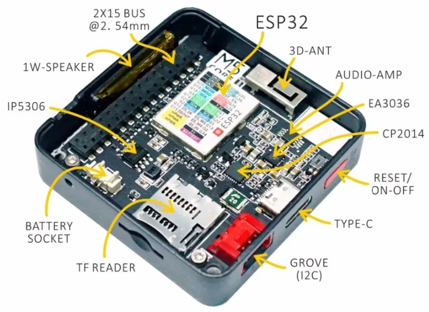

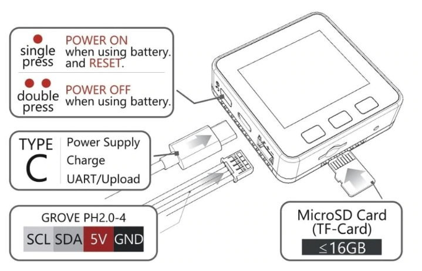

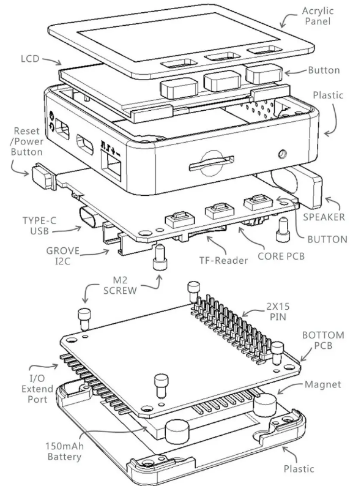
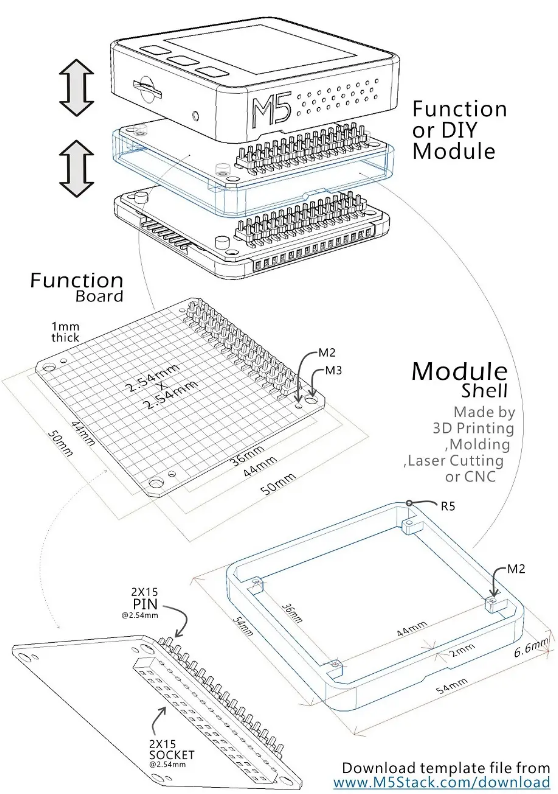
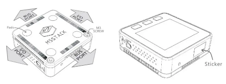
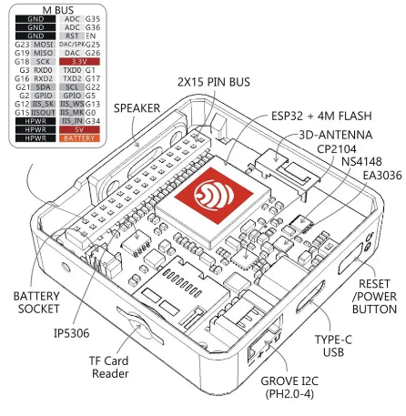
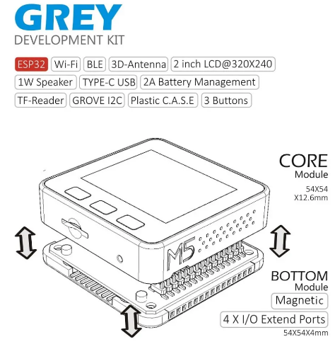
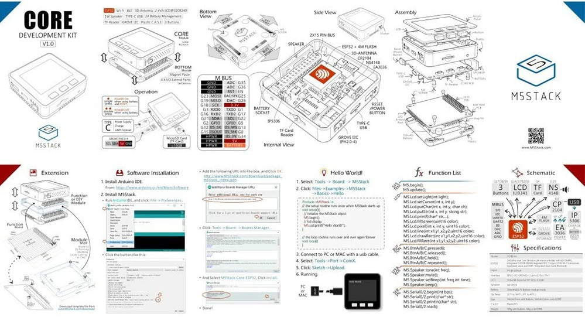
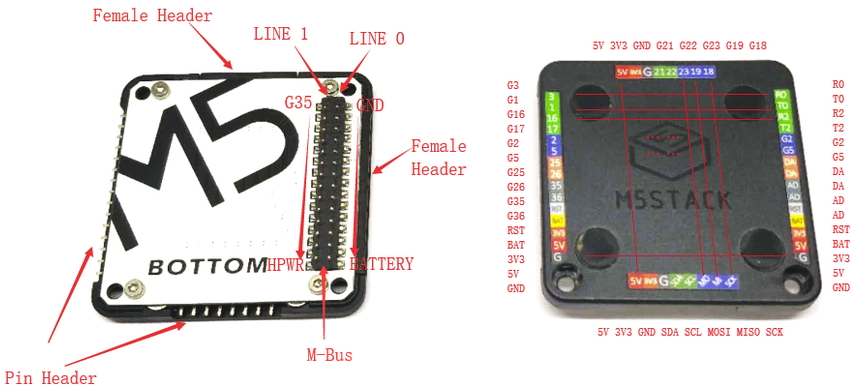
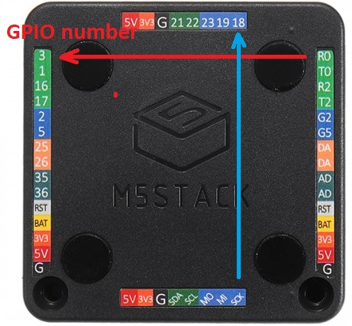
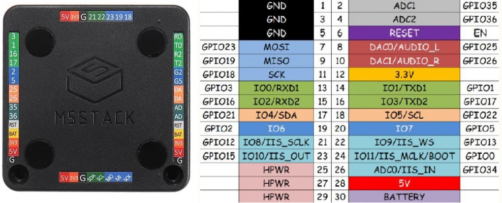
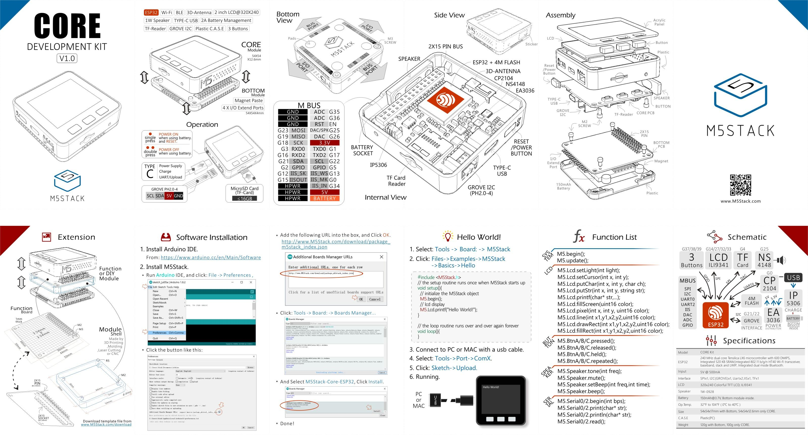

## Características

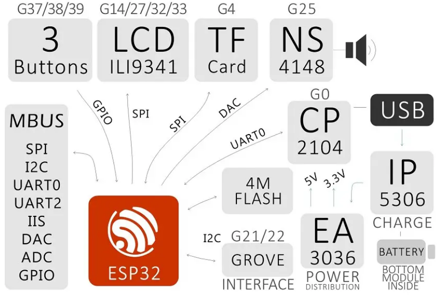

*  Wi-Fi 802.11b / g /  y Bluetooth
* 16Gb de flash
Flash de 16 MByte + 520K RAM
MPU6886 + BMM150
Altavoz, 3 botones, LCD (320 * 240)
Puerto de Grove
M-Bus Enchufe y pines

Tamaño: 54 x 54 x 12,5 mm

Batería: 150 mAh a 3,7 V
LCD: 2 pulgadas, 320x240 Colorful TFT LCD, ILI9341
ESP: 240 MHz de doble núcleo, 600 DMIPS, 520 KB de SRAM, Wi-Fi, modo dual Bluetooth
Flash: 16Mb
Tarjeta SD: de hasta 16Gb

[Documentación](https://docs.m5stack.com/#/en/core/basic)

[Tutorial de inicio](https://docs.m5stack.com/#/en/quick_start/m5core/m5stack_core_quick_start)

[Datasheet del ESP32](https://www.espressif.com/sites/default/files/documentation/esp32_datasheet_en.pdf)

[Esquematico](https://github.com/m5stack/M5-Schematic/blob/master/Core/Basic/M5-Core-Schematic(20171206).pdf)

[Doc del LCD](https://community.m5stack.com/topic/69/micropython-on-webide-2-lcd-graphics)

## Recursos

[Modelos de m5Stack](https://docs.m5stack.com/#/)

[Ejemplos 1](https://github.com/tuupola/micropython-m5stack)

[M5Stack Micropython Base](https://github.com/m5stack/M5Stack_MicroPython)

[M5Cloud para m5Stack](https://github.com/m5stack/M5Cloud#micropython-api)

[M5Go](https://github.com/m5stack/M5GO)

[Módulos para mycropython bare](https://github.com/lukasmaximus89/M5Stick-C-Micropython-1.12)

[Uso de Thonny con micropython](https://raw.githubusercontent.com/Freenove/Freenove_Ultimate_Starter_Kit_for_ESP32/master/Python/Python_Tutorial.pdf)

https://github.com/lukasmaximus89/M5Stack-Core-Micropython-1.12

https://github.com/lukasmaximus89/M5Stick-C-Micropython-1.12

https://github.com/m5stack/UIFlow-Code
https://github.com/m5stack/UIFlow-Code/wiki/Advanced

[m5Stack SD updater](https://github.com/tobozo/M5Stack-SD-Updater)

[Projects](https://www.hackster.io/m5stack/projects)

[m5Edu](http://m5edu.com/)

[Guía pedagógica de STEM de m5stack](https://tienda.bricogeek.com/download/PRO-0257/guia_pedagogica_stem_m5stack.pdf)

[Documentación bricogeek](https://tienda.bricogeek.com/m5stack-esp32/1417-m5stack-esp32-basic-core-iot-kit.html)