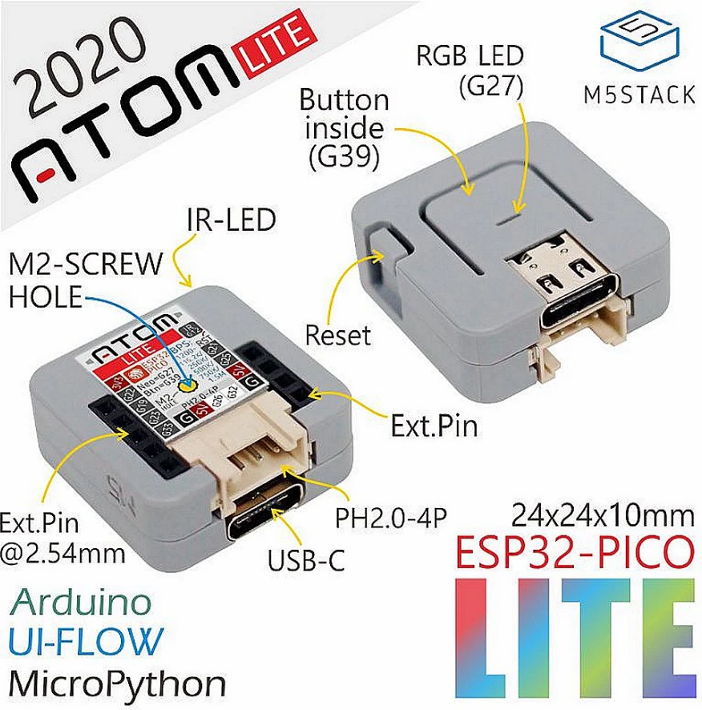

# m5Stack Atom Lite

[Producto](https://www.banggood.com/M5Stack-ATOM-Lite-ESP32-Development-Board-Kit-Neo-LED-Blockly-Programmable-Kit-p-1645120.html)

## Características

* USB Type-C
* ESP32-based
* Case Material: PC + ABS
* 4 MByte flash
* 1 Reset button
* 1 RGB led
* 1 Programmable button
* Infra-red
* 2.4G Antenna: Proant 440
* 6 x GPIO (Dupont Pins)
* GROVE/4P PH2.0 interface

## Pinout

Atom|GPIO
---|---
RGB Led	|G27
Btn|	G39
IR|	G12

## Recursos

[Codigo para Arduino](https://github.com/m5stack/M5Atom)

[ESP32 Pico](https://m5stack.oss-cn-shenzhen.aliyuncs.com/resource/docs/datasheet/core/esp32-pico-d4_datasheet_en.pdf)

[Video tutorial / ATOM](https://m5stack.oss-cn-shenzhen.aliyuncs.com/video/Product_example_video/Core/ATOM_LITE.mp4)

