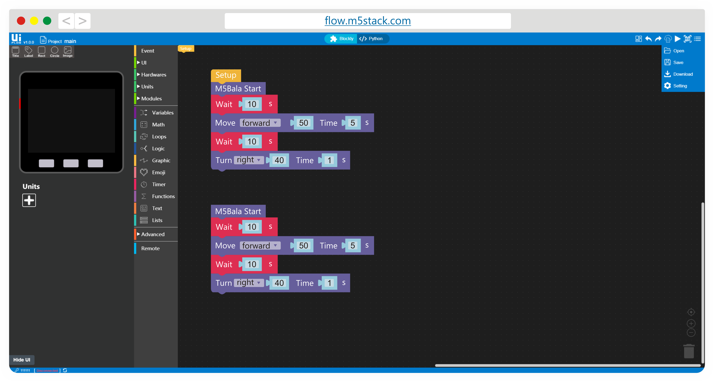
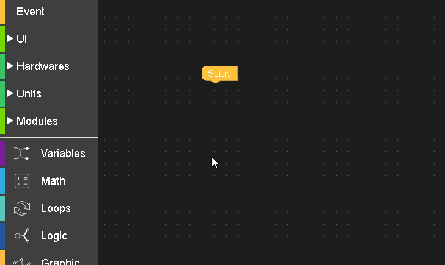

# IUFlow

Entorno de desarrollo de aplicaciones en la nube con bloques o python

[IDE](https://flow.m5stack.com/)

[Descarga](https://docs.m5stack.com/#/en/quick_start/m5stickc/m5stickc_quick_start_with_uiflow)

[Documentacion](https://m5stack.github.io/UIFlow_doc/en/)

