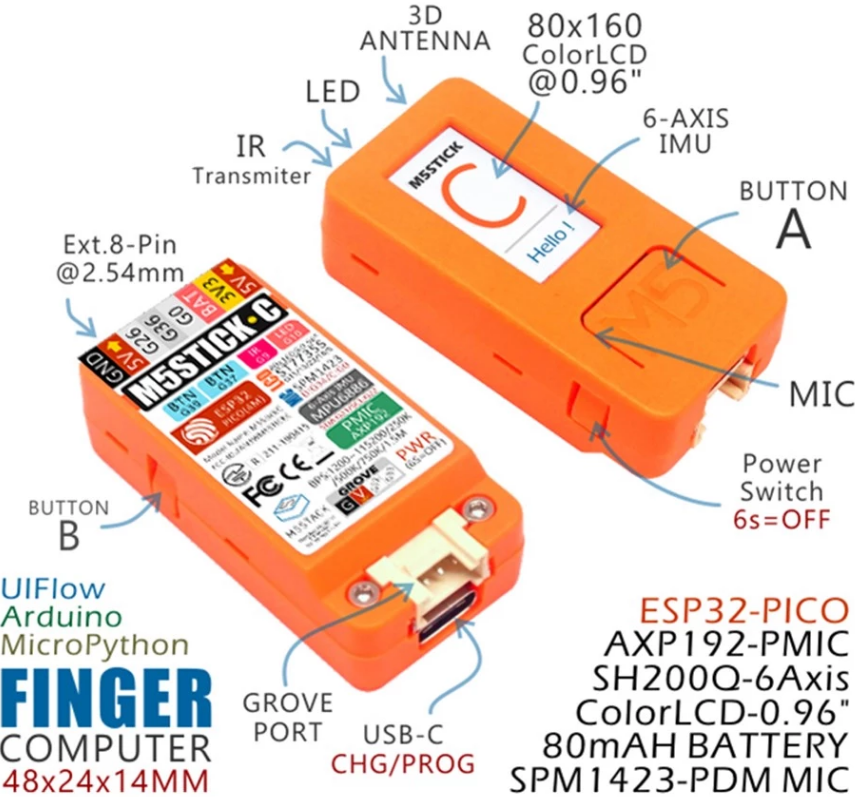
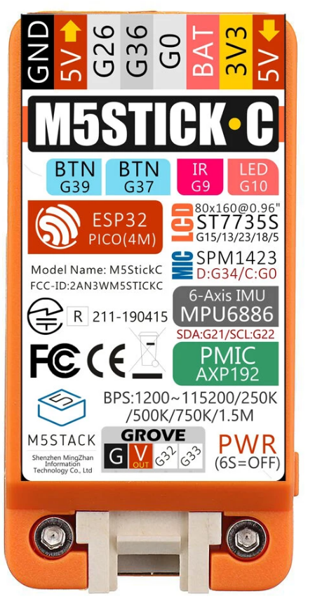
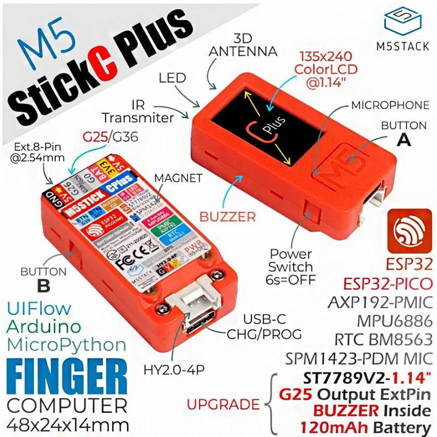

# M5Stick-C 

# M5StickC
[m5StickC](https://es.aliexpress.com/item/4000166551564.html)
 

## Características

* Fuente de alimentación de 5V CC
* USB tipo-C
* Basado en el desarrollo de ESP32: 
    * 802.11b/g/n HT40 Wi-Fi
    * Bluetooth BLE
    * Sensor Hall
* 4 MByte Flash + 520K RAM
* IMU de 6 ejes MPU6886/SH200Q
* LED rojo
* Micrófono
* 2 x Botones 
* LCD (0,96 pulgadas), botón de encendido/reinicio x1
* 2,4G antena: Proant 440
* 80 mAh batería de litio
* Conector Grove

Plataformas de desarrollo: UIFlow, MicroPython, Arduino

|ESP32|pin|
|---|---|
|Led rojo|GPIO10
|Ir|GPIO09
|Boton A|GPIO37
|Boton B|GPIO39

TFT LCD 80 * 160 : ST7735S

|LCD |ESP32	
|---|---	
|TFT_MOSI|	GPIO15
TFT_CLK|	GPIO13	
TFT_DC|	GPIO23	
TFT_RST|	GPIO18	
TFT_CS|  GPIO5

|PUERTO GROVE|GPIO
|---|---
SCL |GPIO33
SDA |	GPIO32

|MIC (SPM1423)|GPIO
|---|---
|SCL|	GPIO0
SDA|	GPIO34

IMU 6 ejes (MPU6886)|GPIO
---|---
PMU - gestion  energía (AXP192)|GPIO
SCL|GPIO22
SDA|	GPIO21

RTC - BM8563

## Pinout

There are five IO pins available:
0: ADC, PWM, touch, has the microphone connected to it
26: ADC, PWM, DAC
32: ADC, PWM, touch, I2C, on the Grove connector
33: ADC, PWM, touch, I2C, on the Grover connector
36: ADC, PWM, input only,  has the ESP’s hall effect sensor connected to it.

## Modelo 2019

[Producto](https://docs.m5stack.com/#/en/core/m5stickc)

## Modelo Plus

[Producto](https://docs.m5stack.com/#/en/core/m5stickc)

LCD screen	1.14 inch, 135*240 Colorful TFT LCD, ST7789v2

	built-in buzzer - G2

PIN port	G0, G25/G36, G26, G32, G33

Battery	120 mAh @ 3.7V

 

[Pinmap](https://m5stack.oss-cn-shenzhen.aliyuncs.com/resource/docs/schematic/Core/M5StickC/20191118__StickC_A04_3110_Schematic_Rebuild_PinMap.pdf)

## Recursos

https://tinkerfarm.net/projects/the-m5stickc/

[Proyectos en Hackster.io](M5stack.hackster.io/)

[Todos los productos m5Stack](https://docs.m5stack.com/#/)

## Datasheet

[Documentacion](https://github.com/m5stack/M5-Schematic/blob/master/Core/esp32-pico-d4_ficha%C2%A0de%C2%A0datos_cn.pdf)

[LCD ST7735S](https://github.com/m5stack/M5-Schematic/blob/master/Core/ST7735S_v1.1.pdf)

[IMU MPU6886](https://github.com/m5stack/M5-Schematic/blob/master/ficha%C2%A0de%C2%A0datos/MPU-6886-000193%2Bv1.1_GHIC.PDF.pdf)

[Mic SPM1423 ](https://pdf1.allficha%20de%20datos.com/ficha%C2%A0de%C2%A0datos-pdf/view/546596/KNOWLES/SPM1423HM4H-B.html)

[Energia AXP192](https://github.com/m5stack/M5-Schematic/blob/master/Core/AXP192%20Datasheet%20v1.13_cn.pdf)

## Micropython

https://lemariva.com/blog/2020/02/m5stack-micropython-and-bluetooth-ble

### Firmware

https://github.com/loboris/MicroPython_ESP32_psRAM_LoBo/wiki/firmwares

### Build

https://github.com/loboris/MicroPython_ESP32_psRAM_LoBo/wiki/build

### OTA
https://github.com/loboris/MicroPython_ESP32_psRAM_LoBo/wiki/ota

[M5 stick](https://github.com/m5stack/m5-docs/blob/master/docs/en/core/m5stick.md)

[Quick start](https://docs.m5stack.com/#/en/quick_start/m5stickc/m5stickc_quick_start_with_uiflow)

[Micropython para M5Sstick](https://github.com/m5stack/M5Stack_MicroPython)

[First steps with m5stick-c](https://www.hackster.io/glowascii/first-steps-with-m5stick-c-74804c)

### Proyectos

#### [Robot equilibrista](https://m5stack.com/collections/m5-application/products/bala-c-esp32-development-mini-self-balancing-car)

[Código](https://github.com/m5stack/M5-ProductExampleCodes/blob/master/App/BalaC/Arduino/Balac/Balac.ino)

### Ejemplos

[Neopixels](https://m5stack.hackster.io/ronfrtek/m5stickc-esp32-and-neopixels-led-ring-random-color-03d508)

[Text scrooling](https://m5stack.hackster.io/hague/m5stickc-textbuffer-scrolling-display-fb6428)

[Fire effect (micropython)](https://www.hackster.io/remixer-dec/9-micropython-mini-projects-for-m5stickc-c07eb1)

[Fire effect (C++)](https://m5stack.hackster.io/MajorSnags/m5stickc-flame-demo-ee6672)

[Web server](https://www.hackster.io/lukasmaximus89/m5stack-micropython-simple-web-server-20a4c4)

[Juego snake](https://github.com/remixer-dec/M5Stack_Experiments/tree/master/M5StickC/UIFlow/Snake)